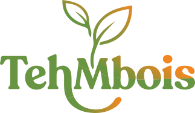

<p align="center">
  
</p>

<h1 align="center">PredikAI — TehMbois</h1>

<p align="center">
  <strong>Platform AI Business Intelligence untuk UMKM Food & Beverage</strong>
</p>

<p align="center">
  
  
  
  
  
  
</p>

---

## 📖 Tentang PredikAI

**PredikAI** adalah platform berbasis AI yang dirancang khusus untuk membantu pelaku UMKM di sektor Food & Beverage (F&B) dalam memprediksi penjualan dan menentukan rekomendasi produksi harian. Sistem ini memanfaatkan data historis penjualan, prakiraan cuaca, hari libur nasional, dan event lokal untuk memberikan insight bisnis yang akurat.

Studi kasus yang digunakan adalah **TehMbois**, sebuah brand es teh khas Malang.

### Tujuan Utama

- 📉 **Mengurangi overstock & understock** — Produksi sesuai prediksi, bukan tebakan.
- 📊 **Keputusan berbasis data** — Semua rekomendasi didukung oleh analisis AI.
- 🤖 **AI Business Consultant** — Bukan sekedar POS biasa, tapi asisten cerdas untuk UMKM.

---

## ✨ Fitur Utama

| Modul | Deskripsi |
|---|---|
| **Landing Page** | Showcase produk TehMbois dengan fitur order interaktif |
| **Dashboard Owner** | Ringkasan penjualan, prediksi AI, cuaca, dan rekomendasi |
| **Manajemen Bisnis** | CRUD outlet/kedai, switch antar cabang |
| **Manajemen Menu** | CRUD menu, HPP, harga jual, import dari Excel/CSV |
| **Input Penjualan** | Form input harian per menu, koreksi data, riwayat transaksi |
| **Prediksi & Rekomendasi AI** | Faktor eksternal, prediksi mingguan/bulanan, rekomendasi produksi dengan override |
| **Faktor Eksternal** | Prakiraan cuaca 14 hari, kalender libur nasional, event lokal |
| **Laporan Performa** | Grafik aktual vs prediksi, breakdown per menu, badge akurasi, download PDF |
| **Autentikasi** | Register, Login, Logout dengan JWT |

---

## 🛠️ Tech Stack

### Backend
- **PHP 8.3+**
- **Laravel 13** — Framework utama
- **Inertia.js** — Bridge antara Laravel dan React (SPA tanpa API terpisah)
- **Laravel Sanctum** — API authentication
- **JWT Auth** — Token-based authentication untuk API
- **Maatwebsite Excel** — Import/export data Excel & CSV
- **L5-Swagger** — Dokumentasi API otomatis

### Frontend
- **React 19** — UI library
- **TypeScript 6** — Type safety
- **Vite 8** — Build tool & dev server
- **TailwindCSS 4** — Utility-first CSS framework
- **Recharts** — Charting library untuk grafik dan visualisasi data
- **Radix UI + Shadcn UI** — Komponen UI accessible dan modern
- **Tabler Icons** — Icon library
- **Motion (Framer Motion)** — Animasi dan transisi halus
- **Lenis** — Smooth scrolling

### Database
- **MySQL** — Database utama

---

## 🚀 Instalasi & Setup

### Prasyarat

Pastikan perangkat Anda sudah terinstal:

- [PHP 8.3+](https://www.php.net/)
- [Composer](https://getcomposer.org/)
- [Node.js 20+](https://nodejs.org/) & npm
- [MySQL 8+](https://www.mysql.com/)
- [Git](https://git-scm.com/)

### Langkah Instalasi

**1. Clone Repository**

```bash
git clone https://github.com/mohamadarif03/umkm-website.git
cd umkm-website
```

**2. Install Dependensi PHP**

```bash
composer install
```

**3. Install Dependensi Node.js**

```bash
npm install
```

**4. Konfigurasi Environment**

```bash
cp .env.example .env
```

Kemudian buka file `.env` dan sesuaikan konfigurasi berikut:

```env
DB_DATABASE=predikai
DB_USERNAME=root
DB_PASSWORD=password_anda

GEMINI_API_KEY=api_key_gemini_anda
```

**5. Generate Application Key**

```bash
php artisan key:generate
```

**6. Generate JWT Secret**

```bash
php artisan jwt:secret
```

**7. Jalankan Migrasi Database**

Pastikan database MySQL `predikai` sudah dibuat terlebih dahulu, lalu jalankan:

```bash
php artisan migrate
```

**8. (Opsional) Jalankan Seeder**

```bash
php artisan db:seed
```

**9. Jalankan Aplikasi**

Buka **dua terminal** secara bersamaan:

```bash
# Terminal 1 — Laravel Backend
php artisan serve
```

```bash
# Terminal 2 — Vite Dev Server (Frontend)
npm run dev
```

Atau gunakan perintah shortcut:

```bash
composer dev
```

Aplikasi akan berjalan di **http://localhost:8000**.

---

## 📁 Struktur Project

```
umkm-website/
├── app/                    # Logic backend (Controllers, Models, dll)
├── database/               # Migrasi, Seeder, Factory
├── public/                 # Asset publik (gambar produk, logo)
├── resources/
│   ├── css/                # Stylesheet utama
│   └── js/
│       ├── components/     # Komponen reusable (UI, Dashboard cards)
│       ├── layouts/        # Layout utama (DashboardLayout, AppLayout)
│       └── Pages/          # Halaman Inertia.js
├── routes/
│   ├── web.php             # Routes halaman (Inertia)
│   └── api.php             # Routes API (REST)
├── .env.example            # Template konfigurasi environment
├── composer.json           # Dependensi PHP
├── package.json            # Dependensi Node.js
└── vite.config.js          # Konfigurasi Vite
```

---

## 🔗 API Endpoints

Dokumentasi API tersedia melalui Swagger UI setelah menjalankan aplikasi:

```
http://localhost:8000/api/documentation
```

### Ringkasan Endpoint

| Method | Endpoint | Deskripsi |
|--------|----------|-----------|
| `POST` | `/api/register` | Registrasi user baru |
| `POST` | `/api/login` | Login dan mendapatkan token |
| `POST` | `/api/logout` | Logout user |
| `GET` | `/api/me` | Profil user yang login |
| `CRUD` | `/api/businesses` | Manajemen bisnis/kedai |
| `CRUD` | `/api/businesses/{id}/menus` | Manajemen menu per bisnis |
| `POST` | `/api/businesses/{id}/menus/import` | Import menu dari Excel/CSV |
| `CRUD` | `/api/businesses/{id}/daily-sales` | Input penjualan harian |
| `GET` | `/api/businesses/{id}/predik-ai/external-factors` | Data faktor eksternal AI |

---

## 👤 Role Pengguna

| Role | Akses |
|------|-------|
| **Owner** | Dashboard lengkap, prediksi AI, manajemen bisnis & menu, laporan, semua fitur |
| **Cashier** *(planned)* | Input transaksi sederhana, UI minimalis, mobile-friendly |

---

## 🎨 Design System

Aplikasi ini mengikuti design system modern SaaS terinspirasi dari **Stripe**, **Notion**, **Linear**, dan **Vercel**:

- **Warna Utama**: Emerald green `#096956`, White, Neutral gray
- **Font**: Plus Jakarta Sans, Figtree, Nunito Sans
- **Komponen**: Card-based layout, rounded corners, soft shadows
- **Animasi**: Micro-interactions, smooth scroll (Lenis), hover transitions

---

## 📄 Lisensi

Project ini dikembangkan untuk keperluan akademis dan pembelajaran.

---

<p align="center">
  Dibuat dengan ❤️ untuk UMKM Indonesia
</p>
